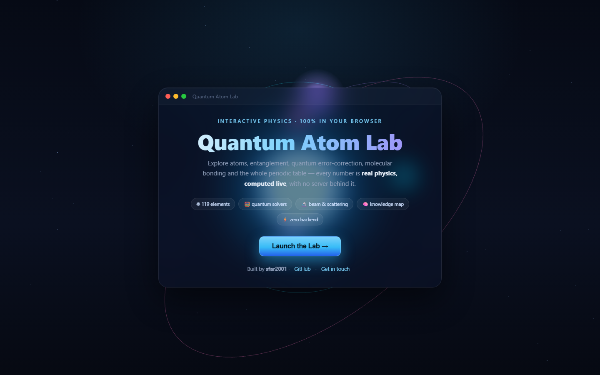
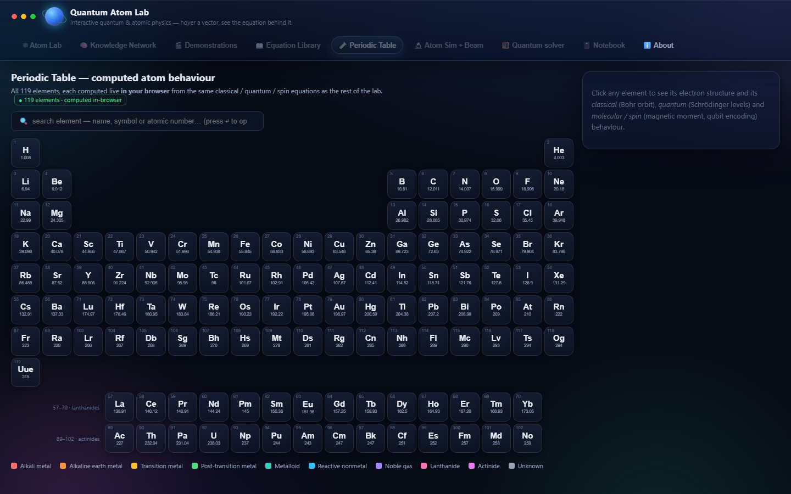
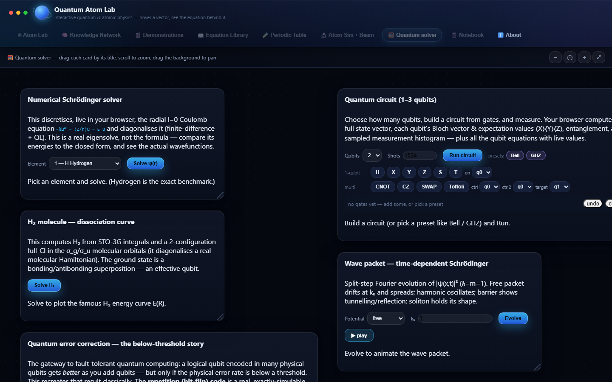
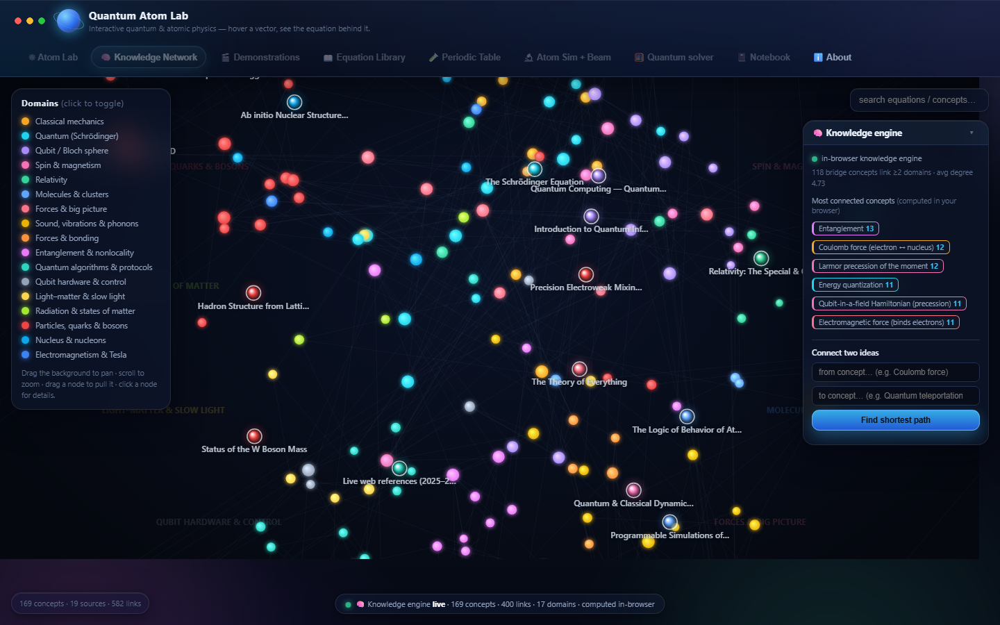

<p align="center">
  
</p>

<h1 align="center">⚛️ Quantum Atom Lab</h1>

<p align="center">
  <b>An interactive quantum &amp; atomic-physics playground that runs 100% in your browser.</b><br/>
  Entanglement, quantum error-correction, molecular bonding, beam scattering, and all 119 elements —<br/>
  every number is <b>real physics, computed live</b>. No server. No sign-up. Just open it.
</p>

<p align="center">
  <a href="https://inspiring-praline-f198cd.netlify.app"></a>
</p>

<p align="center">
  
  
  
  
</p>

<p align="center">
  <a href="#-a-quick-look"><b>📸 Screenshots</b></a> ·
  <a href="#-launch"><b>🚀 Launch</b></a> ·
  <a href="#-whats-inside"><b>🔭 What's inside</b></a> ·
  <a href="#-the-physics-is-real"><b>🧪 The physics</b></a> ·
  <a href="#-get-in-touch"><b>📬 Contact</b></a>
</p>

---

## 📸 A quick look

| Landing — 3D atom & glass UI | Periodic Table — 119 live elements |
|:--:|:--:|
|  |  |
| **Quantum Solver** — circuits, H₂, tunnelling, error-correction | **Knowledge Network** — 130+ concepts, live analytics |
|  |  |

---

## 🚀 Launch

**Just open `index.html`** — that's the whole app.

```bash
# any static host works, or simply double-click index.html
npx serve .        # → http://localhost:3000
```

Deployed on **Netlify** as a plain static folder — drag the folder into Netlify (or connect the repo) and it's live. There is nothing to build and nothing to run.

> Press **“Launch the Lab →”** on the landing screen to enter. Everything computes on your device.

---

## 🔭 What's inside

| | Module | What you can do |
|---|---|---|
| ⚛️ | **Atom Lab** | Hover any vector on a live atom to reveal the exact equation behind it — Coulomb force, spin precession, Bloch rotation, bonding. |
| 🧠 | **Knowledge Network** | A force-directed map of ~130 physics concepts across 7 domains. Search, drag, and find the **shortest path between any two ideas**. |
| 🎬 | **Demonstrations** | Animated cards where *the motion is the math* — orbits, oscillations, phonons, precession, entanglement. |
| 📖 | **Equation Library** | Every equation, tagged by domain and provenance, with worked examples you can expand. |
| 🧪 | **Periodic Table** | All **119 elements**, each with its classical (Bohr), quantum (Schrödinger) and spin/molecular behaviour — computed on the spot. |
| 🔬 | **Atom Sim + Beam** | Fire a photon or a particle at any atom and watch it **photo-ionize, excite, Compton-scatter, or Rutherford-deflect** — with the calculation revealed step by step. |
| 🧮 | **Quantum Solver** | A real numerical Schrödinger solver, a **1–3 qubit circuit simulator** (Bell/GHZ, Bloch spheres, entanglement), the **H₂ dissociation curve**, a **time-dependent wave-packet** (tunnelling), and a **quantum-error-correction threshold** demo. |
| 📓 | **Notebook** | Your own lab notebook — drop in equations, run experiments, drag atoms together to react them. Saved in your browser. |

---

## 🧪 The physics is real

This isn't a set of pre-rendered animations. A single in-browser engine solves the actual equations, live:

- **Schrödinger** — a finite-difference radial eigensolve (QL algorithm on a 500-point grid), benchmarked against the exact hydrogen levels.
- **Quantum circuits** — a full complex state-vector simulator: gates, per-qubit Bloch vectors, reduced density matrices, entanglement, and sampled measurement.
- **H₂ molecule** — STO-3G Gaussian integrals + a 2-configuration full-CI → the famous dissociation curve **E(R)** and an effective qubit Hamiltonian.
- **Wave packets** — the time-dependent Schrödinger equation by split-step Fourier (free / harmonic / barrier tunnelling / soliton).
- **Error correction** — repetition-code logical error (exact + Monte-Carlo) and the surface-code sub-threshold story.
- **Beams & bonding** — photoelectric effect, Compton scattering, Rutherford scattering, and ionic/covalent/metallic bond prediction.

*Validated against known values* (hydrogen −13.6 eV, Bell-state entanglement, H₂ ≈ 0.74 Å / −1.14 Ha, and more).

---

## 🧠 How it works (the interesting bit)

The full lab is engineered on **distributed Akka actor clusters (Java)** — the physics engine, the periodic-table server, the knowledge engine and the **Quanta** AI assistant all run as cooperating Akka actors. For this public, static build that physics was faithfully **re-implemented in pure JavaScript** and wired behind a tiny `fetch` shim:

```
your click ──► fetch("/api/…") ──► api-shim.js ──► physics-engine.js ──► live result
                                        (no network, no server — it all runs on your device)
```

```
index.html            the app + 3D landing hero
theme-mac.css         macOS-style glass / shadow layer
js/physics-engine.js  all the real numerical physics
js/api-shim.js        turns /api/* calls into in-browser computation
js/hero.js            the three.js atom on the landing screen
```

The result: a rich, multi-tab physics lab that is **completely static** — perfect for GitHub Pages or Netlify, and it even works from a `file://` double-click.

---

## 🌌 Part of a bigger lab

- **🔬 Quantum Atom Lab** — the interactive simulation in this repo (you're looking at it).
- **🥽 VR Quantum World** — a WebXR experience for Meta Quest: walk through atoms, orbitals and quantum states in room-scale 3D.
- **🤖 Quanta** — an AI lab assistant, backed by a distributed compute cluster, that reasons over the knowledge base and can drive the lab.
- **🧭 Guided Onboarding** — a step-by-step interactive tour, from first atom to first quantum circuit.

*Curious about any of these? [Get in touch](#-get-in-touch).*

---

## 📬 Get in touch

I build interactive science &amp; engineering tools. If you like this, want a collaboration, or have an idea — I'd love to hear from you.

- 💻 **GitHub** — [@sfar2001](https://github.com/sfar2001)
- ✉️ **Email** — [adam@actimi.com](mailto:adam@actimi.com)

<p align="center"><sub>Designed &amp; built by <b>sfar2001</b> · quantum physics, made touchable.</sub></p>
